# Kan Bağışı Merkezi Veritabanı

ve

Web Portalı

.fx: first

Nisan 2012

Emin Eker `<emineker@bil.omu.edu.tr>`

Dilara Koca `<dilara@bil.omu.edu.tr>`

---

# Proje Tanımı

- Kan bankalarının ve hastanelerin yakın çevrede olan ve kısa zamanda kan bağışı yapabilecek kişileri bulabilecekleri çevrimiçi, merkezileştirilmiş bir web portalı oluşturulacak.
- Ayrıca, hızla değerlendirmek üzere kan bağışı yapan kişilerin sağlık raporlarının kaydını tutacaktır.

- Kan bağışı merkezi veritabanı ve web portalı kan bağışçılarının gönüllülükleri ile doğru orantılı olarak kan bağışlarının kayıt altına alınması ve ihtiyaçlar doğrultusunda (acil durumlarda) sisteme daha önceden kayıt yaptırmış ve onay olmış kurumlar tarafından email veya telefon aracılığı ile kendilerine anında ulaşılmasını sağlayacaktır.

---

# Projenin Temel Özellikleri

Sistemde dört çeşit kullanıcı olacaktır. Bunlar; donör, misafir, kurum ve
yönetici kullanıcılarıdır. Bütün kullanıcılar sisteme kullanıcı adı ve sifresi
ile giriş yapabilecektir. Kullanıcı tiplerinin özellikleri şöyledir:

## Kapsam

Öncelikler belirli bir bölgeyi kapsayacak bu proje daha sonra tüm ülkeye yayılıp
merkezi bir sistem olarak gerekli kurum ve kuruluşlara hizmet sağlayacaktır.

---

# Kullanıcı Tipleri ve Özellikleri

- **Donör:** Kan gurubu, ad, soyad, cinsiyet, doğum günü, iletişim bilgişleri ve
parola bilgilerini doğru colarak doldurarak kayıt olunur. Kayıt isteği yönetici
tarafından onaylandıktan sonra sisteme giriş yapabilir.
Kaydı onaylanan kullanıcı, giriş yaptıktan sonra bilgilerini
düzenleyebilir,parolasını değiştirebilir.

- **Misafir:** Sisteme giriş yapmasına gerek yoktur. Arama yapmak istediği il ve
aradıkları kan grubunu girerek Donör Sorgulama özelliğini kullanabilir. Sisteme
kayıtlı olan kurum ve kuruluşları görebilir.

- **Kurum:** Adı, tipi, iletişim bilgişleri ve parola bilgilerini doğru olarak doldurarak kayıt olunur.
Kullanıcının kayıt işleminden sonra sisteme giriş yapabilmesi için yönetici
tarafından gerçek bir kurum veya kuruluş olduğu görülmeli ve başvurusu
onaylanmalıdır.
Kaydı onaylanan kullanıcı, Kurum Girişi yaptıktan sonra kendi kurum bilgilerini
düzenleyebilir, parolasını değiştirebilir. Arama yapmak istediği il ve
aradıkları kan grubunu girerek Donör Sorgulama özelliğini kullanabilir.

- **Yönetici:** Yönetici Girişi yaptıktan sonra yöneticileri, kurum rollerini,
kurumları, donörleri ve onlara ilişkin tüm ayrıntıları, ayrıca donörlerin özel
isteklerini, kayıtlı kan verme işlemlerini, sargulama sayısını görebilir.

---

# Kullanım Senaryosu Modeli

- Donör, sisteme tamamen kendi isteğiyle kayıt olabilir ve sistem üzerinde bir parolaya sahip olur.
- Aynı zamanda sistem kullanıcı adı olacak email adresi ve parolasıyla sisteme giriş yapar.
- Sistemde içerisinde kayıt olurken verdiği bilgileri düzenleyebilir, parolasını değiştirebilir.
- Donör ve kurumlar açısından önemli olan bir diğer faktör kullanıcının sağlık bilgileri ve kan verme tarihleridir. Donör yine bu bilgileri de güncelleyebilmektedir.

---

# Tanımlar, Kısa Adlar ve Kısaltmalar

- **Donör:** Gönüllü kağ bağışçısı

- **Kurum:** Sürekli veya acil kan ihtiyacı olan devlet kurumu veya özel kuruluşlar (hastaneler, klinikler vb.)

- **Admin:** Sistem yöneticisi

---

# Geliştirme Ortamı

- Proje MySQL veritabanı ve Ruby programlama dili kullanılarak Ruby on Rails web çatısı üzerinde Linux işletim sistemi Debian dağıtımı üzerinde geliştirilmiştir.
- Projede ayrıca Java Script kodları da yer yer kullanılmıştır.
- Web sunucusu olarak ise Nginx kullanılmıştır. Aynı zamanda production bir Rails sistemi çalıştırabilmek için Unicorn Rails sunucusu kullanılmıştır.
- Proje, geliştiricileri tarafından ayrı ortamlarda hazırlanmıştır.

- Tüm geliştiriciler:

    - ruby >= 1.9.2
    - rails >= 3.1.0
    - Nginx 1.1.17
    - MySQL 5.1.61
    - unicorn v4.2.0
    - imagemacik görüntü işleme paketi
paketlerini kullanmışlardır.

Proje geliştirilme esnasında Chromium browser 19.01.1077 üzerinde çalışılmış olup diğer tüm tarayıcılarda test edilmiştir.

---

# Neden Ruby on Rails

Ruby on Rails (RoR) geliştirici verimliliğini artırmak için optimize edilmiştir.

Bu uygulama, geliştiricinin normal geliştirme zaman diliminin yarısında zengin web uygulamaları oluşturmasına yardım etmek için birçok gelişmiş programlama konsepti kullanır.

Her şeyden önce RoR geliştiricilere bir dizi avantaj sunmaktadır:

- Hızlı geliştirme modelini destekler,
- Perl ve Python destekli tutarlı ve basit nesne yönelimli dil,
- CGI veya Fast CGI ile herhangi bir web sunucusunda çalışır,
- MVC mimari uygulaması programlama senkronize,
- Gelişmiş ilkeler kullanır: Kurulum Sözleşmesi CoC ve DRY,
- Kısa zaman dilimleri içerisinde uygulama geliştirme için idealdir,
- MySQL, PostgreSQL, Oracle gibi veritabanları için entegre destek,
- Hata ayıklama, özel URL4ler ve geniş Ajax kütüphanesi.

---

# Profesyonel Yapı ve Görünüm

- Ruby on Rails ortamında hazırlanan bu servisde görsel tasarım açısından Twitter'ın da kullandığı bir açık kaynak servis olan bootstrap kullanıcı arayüzü kullanılmıştır.

- Bootstaap kullanıcı arayüzü hem bilgisayar ortamında hem tabletlerde hem de telefonlarda sorunsuz bir görüntünin elde edilmesini  amaçlar.

- Bu gibi açık kaynak ürünlerin rails ortamına daha hızlı adapte edilebilmesi için ruby gem geliştirilmiştir.
- Bu gem aracılığıyla bu kullanıcı arayüzünü servisimize adapte ettik ve kullandık.

Daha ayrıntılı bilgiyi buradan edinebilirsiniz: [Twitter Bootstrap](http://twitter.github.com/bootstrap/)

---

# Anasayfa

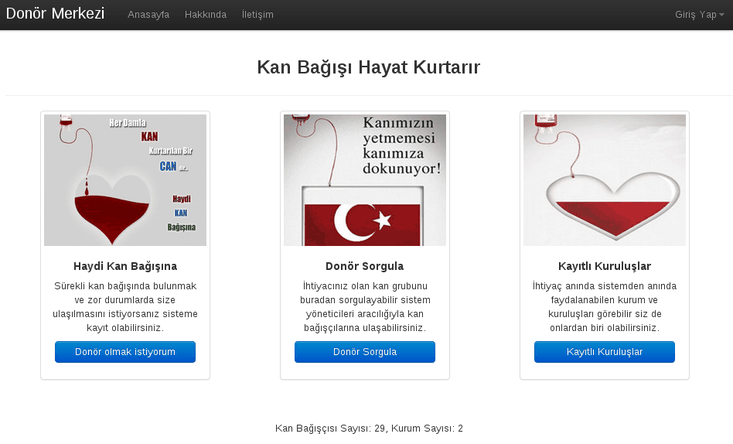

Sayfadaki “Donör olmak istiyorum” butonu kullanıcıyı Donör Kayıt Ekranı'na, “Donör Sorgula” butonu Misafir Sorgu Ekranı'na, “Kayıtlı Kuruluşlar” butonu ise Kurumlar Ekranı'na yönlendirmektedir. Sağ üstteki “Giriş Yap” butonu ise seçim yapılmasının ardından Giriş Ekranı'na yönlendirir.

---

# Donör Kayıt Ekranı

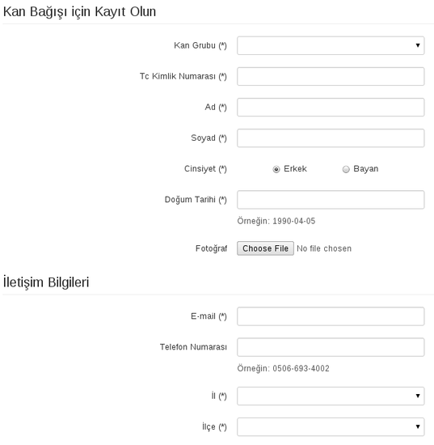

---

# Donör Kayıt Ekranı

Ana Sayfa'dan “Donör olmak istiyorum” butonu ile bu ekrana ulaşılmaktadır.

- Bu ekranda kan bağışçıları, kişisel bilgilerini girerek sisteme kayıt olabilirler.

- Formda; kan grubu, ad, soyad, il, ilçe, e-mail adresi alanlarının doldurulması zorunludur.
- Sisteme kayıt olmak isteyen donörün gerçek bir kişi olup olmadığının belirlenmesi amacıyla tc kimlik numarası, cinsiyet, doğum günü bilgilerinin de zorunlu tutulması gerektiği düşünülmüştür ve sistem bu şekilde gerçeklenmiştir.
- Diğer alanların doldurulması zorunlu değildir.

Ayrıca

- Kayıt yönetici tarafından onaylanana kadar kullanıcı sisteme giriş yapamaz.
- Kayıt onaylandıktan sonra  verdiği bilgileri düzenleyebilir.

---

# Kurum Kayıt Ekranı

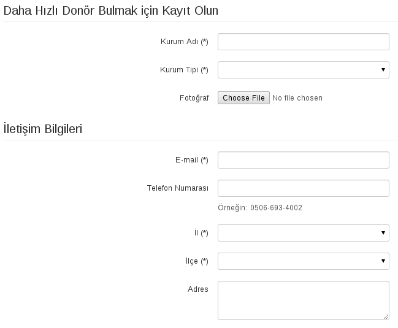

---

# Kurum Kayıt Ekranı

Kurumlar Ekranı'ndan “Yeni Kurum Kaydı” butonu ile bu ekrana ulaşılmaktadır.

- Kurum ve Kuruluşlar bu ekranda kurum bilgilerini girerek sisteme kayıt olabilirler.

- Formda, kayıt olmak isteyen kurum veya kurluşun gerçek olup olmadığının belirlenmesi amacıyla kuruluş adı, kurum tipi, e-mail adresi, il, ilçe alanlarının doldurulması zorunludur.
- Diğer alanların doldurulması zorunlu değildir.

Ayrıca

- Kayıt yönetici tarafından onaylanana kadar kullanıcı sisteme giriş yapamaz.
- Kayıt onaylandıktan sonra  verdiği bilgileri düzenleyebilir.

---

# Kurum Yardım Sayfası

- Kullanıcı girişi yaptıktan sonra görülen “Yardım” butonundan ulaşılmaktadır.
- Kullanılan bu panelin raporda da “Kullanım Kılavuzu” başlığı altında anlatılmıştır

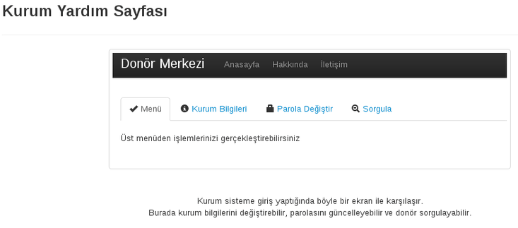

---

# Donör, Kurum, ve Yönetici Girişleri

- **Giriş Yap** butonu üç seçenek sunmaktadır:

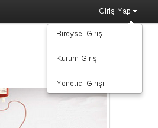

- **Bireysel Giriş,** “Kan Bağışçısı Girişi Ekranı”'na;
- **Kurum Girişi** “Kurum Girişi Ekranı”'na;
- **Yönetici Girişi** ise “Admin Girişi Ekranı”'na yönlendirir.

---

# Örnek Bir Sistem Giriş Ekranı

- **Kan Bağışçısı Girişi Ekranı:** Sisteme donör olarak kayıtlı olan kullanıcı için giriş ekranıdır.

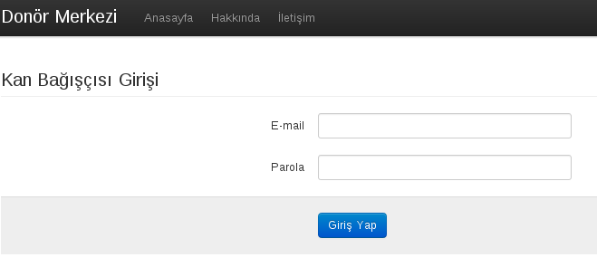

- **Kurum Girişi Ekranı:** Sisteme kurum olarak kayıtlı olan kullanıcı için giriş ekranıdır.
- **Admin Girişi Ekranı:** Sisteme yönetici olarak kayıtlı olan kullanıcı için giriş ekranıdır.

---

# Donör Sorgulama Ekranı

Anasayfa'ndan “Donör Sorgula” butonu ile bu ekrana ulaşılmaktadır.

- Misafirler kullanıcılar da kan grubu il ve/veya ilçe seçerek sistemde sorgu yapabilirler.
- Sorgu sonucunda bulunan uygun donörler hakkında yalnıca cinsiyet, kan grubu, il ve ilçe bilgilerini görebilirler. Başka hiçbir ayrıntıya erişemezler.

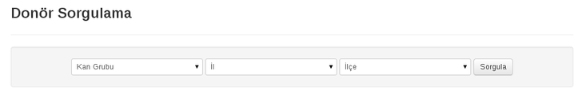

- Kurum olarak kayıtlı ve giriş yapmış kullanıcı da il ve/veya ilçe seçerek sistemde sorgu yapabilirler. Bu sorgu sonucunda bulunan uygun donörler hakkında tüm bilgilerini görebilirler.

---

# Kurum ve Kuruluşlar Ekranı

Anasayfa'ndan “Kayıtlı Kuruluşlar” butonu ile bu ekrana ulaşılmaktadır.

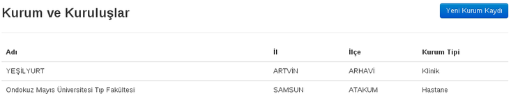

- Misafirler kullanıcılar bu sistemde yer alan kurum veya kuruluşlardan sadece örnek olması amacıyla birkaç tanesini görebilirler.

---

# Donör Paneli

Kan Bağışçısı Girişi yapıldığında bu ekran ile karşılaşılmaktadır.

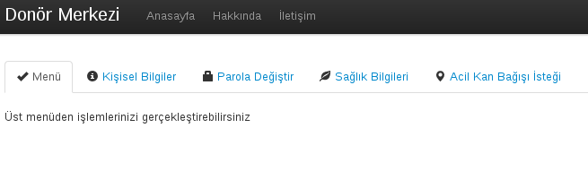

Menüde:

- **Kişisel Bilgiler:** Sisteme kayıt olunurken verilen bütün bilgiler düzenlenilebilir
- **Parola Değiştir:** Donör parolası değiştirme ekranı
- **Sağlık Bilgileri:** Donör kan bağışı yapıp yapamayacağına karar verilecek sağlık bilgileri kayıt ekranı
- **Acil Kan Bağışı İsteği:** Acil kan bağışı isteği gönderilebilir. Donör herhangi bir kan bağışı yardımı için başka bir kan bağışçısı aramaları gerektiğinde bu formu doldurur. Form yöneticiye iletilecektir. Nedenin geçerliliğine göre sonuç alıncaktır.

---

# Donör Bilgileri Güncelleme Ekranı

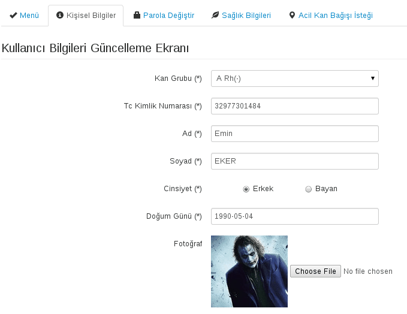

---

# Kurumlar Paneli

Bu panel de yine donör paneli gibi kurum bilgileri güncelleme parola değiştirme gibi ekranların yanısıra bir özel donör sorgulama ekranına sahiptir.

Yapılan sorgu sonucu çıkan kan bağışçılarının

- bilgilerini görebilir
- kan bağışı kayıtlarını yapabilir.

---

# Kan Bağışçısı Sorgulama

**Sorgula:** Kan grubu il ve/veya ilçe seçerek sistemde sorgu yapabilirler.

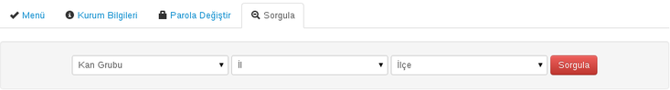

- Yapılan sorgu sonuçları yalnızca son 3 ay içinde kan vermemiş olan kişileri göstermektedir.

- Ayrıca sistem sorgulamada, her üç aydan sonra aynı kan bağışçısını seçmek yerine, her defasında farklı bir kişiyi seçebilecek kadar akıllıdır.

- Kurumlar Paneli'nde yapılan sogulamada, diğer kullanıcıların yaptığı sorgulamalardan farklı olarak, uygun donörlerin adı, soyadı ve donörlerin sistemdeki puanları da görülmektedir.

---

# Kan Bağışçısı Sorgulama

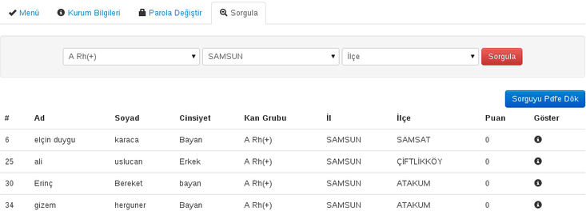

- **Sorguyu Pdf'e Dök:** butonu, yapılan sorgu sonucu elde edilen uygun donörler listesini pdf formatında dışarı aktarır.
- **Donör İncele:** Uygun donörler listesinin her satırında göster butonu bulunmaktadır.

Bu buton ile iki sekmeli yeni bir menü açılır.

- **Donör Bilgileri:** Donörün fotoğraf, kan grubu, adı, soyadı, puan, e-mail, telefon numarası, cinsiyet,  en son kan verme tarihi, doğum tarihi, il, ilçe, adres bilgileri ekrana getirilir.

---

# Kan Verme Kayıt İşlemi

Donör Sorgusu sonucu oluşan listeden **göster** butonuna tıklandığında kullanıcı bilgileri görülebilir ve bu kullanıcının kan verme işleminin kaydı tutulabilir.

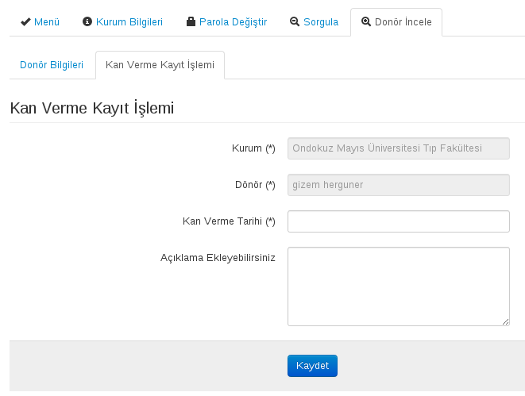

