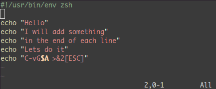

# Vim

.fx: first

Emin Eker `<emineker@gmail.com>`

[http://emineker.net/](http://emineker.net/)

Ekim 2013

---

##  Sistem Yönetimi & Metin Editörleri

*   Özellikle linux temelli işletim sistemleri üzerinde çalışılan sunucularda sistemin ve servislerin yönetimi için çeşitli yönetim arayüzleri geliştirilmiştir

*   Geliştirilen grafik arayüzlerin hem sayısı az hemde yetenekleri kısıtlıdır

*   Bu gibi araçları kullanmak aktif servis veren bir sunucunun sistem kaynaklarından gerektiğinden fazla kullanmasına neden olur

*   Bu ve bunun gibi durumların önüne geçmek için metin editörler tercih edilmektedir

:   Sistem yöneticileri, sistem ve servislere ilişkin yapılandırma dosyalarını düzenleme işlemlerini daima metin editörleri ile yaparlar

---

##  Vim

*   Temeli Bill Joy'un 30 yılı aşmış Vi editörüdür

*   Zaman içerisinde Vi extra özelliklerle güçlendirilmiş ve bugünkü halini almıştır

*   Çok güçlü bir metin editörüdür

Vi ile Vim editörleri arasındaki farklılıkları kaynak dosyalarından öğrenebilirsiniz

        !sh
        $ cat /usr/share/vim/vimr73/doc/vi_diff.txt

---

##  Neden Vim?

*   Linux dağıtımlarında çok fazla metin editörü ve bunların kendilerine ait özellikleri var

*   Bu editörler birbiri ile kıyaslandığında Vim çok gelişmiş bir metin editörüdür

*   Sistem yöneticilerin ve programcıların işlerini oldukça kolaylaştırır

*   Birçok işlemi metin pencerenizi kapatmadan aynı anda yapmanızı sağlar

Vim
:   Unix geleneklerine sahip olup

    *   Unix tabanlı hemen hemen her sistemde bulunur.

    *   Özellikle linux sistem yöneticileri ve programcılar tarafından oldukça yaygın kullanılır

---

##  Vim Temel Özellikleri

*   Çoklu pencere

*   Çoklu seviyede UNDO mekanizması

*   Söz dizimi renklendirme

*   Tampon bellek kullanımı

*   Komut modunda dosya ismi tamamlama

Vim bu gibi temel özellikleri ile kendisini diğer editörlerden oldukça farklı bir noktaya taşımıştır

---

##  Örnek Çalışma Anı

*   Indent (programlama diline özgü girintileri tanır ve kodu düzenler)

*   Split (aynı ekran içerisinde birden fazla dosya üzerinde çalışılabilir)

---

##  Öğrenme

*   Vim alışılması zor bir metin editörü

*   Bir kere alıştığınızda çalışmanız çok hızlanır

*   Alışmak, bir tür içgüdü geliştirmek → "Second Nature"

*   "Second Nature"?  Ellerinizin siz düşünmeden üzerine düşeni yapması

---

##  Asıl Konu

*   Klavyeyi on parmak kullanan insanların bu editöre alışması daha kolaydır

*   Klavyenizde sadece belirli bir görevi olan belirli tuşlar vardır

        + ctrl
        + delete
        + imleçler (yön tuşları)

*   Bu tuşların görevleri Vim üzerinde karakter tuşlarıyla da gerçekleştirilebilmektedir

*   Bunun nedeni elleri klavyenin üzerinden ayırmamak ve sürekliği sağlamaktır

---

.fx: correct

*   Bir bilgisayarcı için on parmak herşey demektir

---

##  Taşınabilir

Vim unix geleneğine sahip bir metin editörü demiştik

*   Bu, sadece unix vari işletim sistemlerinde çalışabildiği anlamına gelmiyor

*   Vim tarşınabilir bir programdır

*   Bu yüzden neredeyse tüm işletim sistemleriyle uyumludur

Linux, FreeBSD, AmigaOS, Atari MINT, BeOS, DOS, MacOS, NextStep, OS/2, OSF, UNIX, VMS + Win32 + Win64 gibi

---

##  Kurulum

*   Linux dağıtımlarında bu editöre ulaşmak oldukça kolaydır

*   Terminale gidelim ve bu komutu girelim

        !sh
        $ sudo apt-get install vim

*   Vim editörünü linux dağıtımımıza yüklemiş olduk

---

##  Nasıl Kullanılır?

*   Vim'e erişmek için terminale ismini yazıp çalıştıralım

        !sh
        $ vim

:   Vim Vi’in daha gelişmiş hali demiştik

            !sh
            $ vi

    komutuyla da vim editörüne ulaşılabilir, vi burada bir alias görevindedir

---

##  3 Mod

Vim 3 temel moddan oluşmaktadır

*   insert

    + dosya üzerinde değişiklikler yapılabilir

    + `i` tuşuna basarak yazma moduna geçilir

*   escape

    + kısayollar kullanabilir

    + `esc` tuşuna basarak escape moduna geçilir

*   command

    + dosya üzerinde bul/değiştir gibi kısayollar kullanılabilir

    + dosyadan çıkış yapmadan komut satırı işlemlerinin kısmı gerçekleştirilebilir

    + önce `esc` sonra `:` karakteriyle command moda yani komut moduna geçilir

---

##  Dosya Açmak

*   Bulunduğumuz dizinde `foo.txt` adında bir dosya açalım

        !sh
        $ vim foo.txt

*   Dosya adını belirtmeden de vim'i açabilir

        !sh
        $ vim

*   Çalıştıktan sonra escape moduna geçip

        !sh
        :w foo.txt

komutu ile dosyamızı foo.txt olarak kaydetmiş oluruz

---

##  Dosya Açmak 2

        !sh
        $ vim file1 file2

komutu ile aynı anda birden fazla dosya açabilirsiniz. İlk dosya üzerinde işlem yapılacak dosyadır ve belleğe yüklenir. Dosya üzerinde yapılan değişiklikler kaydedildikten sonra `:next` komutuyla bir sonraki, `:prev` komutuyla bir önceki dosyaya geçilebilir.

*   Varolan dosya içeriklerine daha hızlı erişebilmek için:

        !sh
        $ vim +150 file.txt # dosyayı açar ve imlec 150. satıra gelir

        $ vim +file.txt # dosyayı açar ve imlec son satıra gelir

        $ vim +/foo file.txt # dosyayı açar ve imlec foo yazan ilk satıra gelir

        $ vim -d file1 file2 # birden fazla dosya arasındaki farkları gösterir

---

##  Dosyadan Çıkmak

Biraz önce vim ile açtığımız index.html dosyasında

*   düzenleme yaptık ve dosyadan çıkmadan sadece kaydetmek istiyoruz `:w`

*   düzenleme yaptık ve kaydedip çıkmak istiyoruz `:wq`

*   düzenleme yapmadık olduğu gibi çıkmak istiyoruz `:q`

*   düzenleme yaptık ama yaptığımız değişiklikleri kaydetmeden dosyanın ilk halinde çıkmak istiyoruz `:q!`

Dosyaları farklı kaydetmek için

*   `:w file2` komutuyla üzerinde çalışılan dosyayı file2 adında yeni bir dosya olarak kaydeder

*   `:saveas file2` komutuyla üzerinde çalışılan dosyanın file2 adında bir kopyası oluşturulur ve yeni dosyaya geçilir

*   `:30,55w file2` üzerinde çalışılan dosyanın 30-55. satırlarını file2 adında yeni bir dosya olarak kaydeder

---

##  insert

*   `i` imlecin bulunduğu yere ekleme yapmak için kullanılır
*   `a` imlecin bulunduğu yerin sağına ekleme yapmak için kullanılır
*   `A` imlecin bulunduğu satırın sonuna ekleme yapmak için kullanılır.
*   `o` imlecin bulunduğu yerin bir alt satırına yeni bir satır eklemek için kullanılır
*   `O` imlecin bulunduğu yerin bir üst satırına yeni bir satır eklemek için kullanılır

---

##  İmleçler

*   İmleçler (yön tuşları) ile dosya içerisinde ileri-geri ve-veya sağ-sol yaparak ilerlenebilir

*   Vim içerisinde bu görevi `h-j-k-l` tuşları da yapmaktadır

*   Bu tuşların kullanımı editör içerisinde çok hızlı hareket etmeyi sağlar

         ^
         k	        k tuşu yukarı yönlü hareket eder
    < h     l >	        h tuşu sola, l tuşu sağa hareket eder
         j	        j tuşu aşağı yönlü hereket eder
         v

---

##  Genel Arama

*   `/` ile komut satırına düşülür ve aranmak istenen kelime yazılır

*   `?` ile komut satırına düşülür ve aranmak istenen kelime yazılır

**Kısayol**

*   `*` üzerinde bulunulan kelimeyi ileriye doğru arar

*   `#` üzerinde bulunulan kelimeyi geriye doğru arar

Arama metninin sonuna `\c` eklenmesi aramayı küçük büyük harfe duyarsız kılar

---

##  Satırda Arama

Üzerinde bulunduğunuz satırda:

*   `fx` imleçten sonraki ilk x karakterini bulur

*   `Fx` imleçten önceki ilk x karakterini bulur

*   `tx` imleci bir sonraki x karakterinden önceki ilk karaktere götürür

*   `Tx` imleci Satırdaki bir önceki x karakterinden sonraki karaktere götürür

*   `;` bir önceki arama işlemi ile aynı yönde aramayı tekrarlar

*   `,` bir önceki arama işlemi ile zıt yönde aramayı tekrarlar

Nokta ve noktalı virgülün kullanımı çok hızlı çalışma imkanı sağlar

---

##  Kes - Kopyala - Yapıştır

####  Kes - Kopyala

*   işlemi yapmak istediğimiz satıra gelip

    + kesmek için `dd` tuşuna

    + kopyalamak için `yy` tuşuna basılır

####  Yapıştır

*   yapıştırmak istenilen satıra gelip bu satırın

    + bir alt satırına yapıştırmak için küçük `p` tuşuna

    + bir üst satırına yapıştırmak için büyük `P` tuşuna basılır (shift + p)

---

## Sil

*   Karakter karakter silmek için `delete` ve `x` tuşları kullanılır

*   Visual veya Visual-Block modu ile toplu seçimlerimizde de yine bu tuşlar kullanılabilir

*   Önemli olan Vim mantığı ile ellerimizi kaldırmadan hızlı bir şekilde çalışmaktır

*   `delete` ile de silme işlemini yapabiliriz ama `x` vim üzerinde bu göreve atanmıştır

*   `dd` tuşları ile silmek istediğimiz satırı keserek ortadan kaldırmış oluruz

---

##  Geri - İleri Alma

*   Dosya üzerinde yapılan işlemler geri alınmak istendiğinde komut modunda `:u`
veya escape modunda sadece `u` tuşuna basarak geri alma işlemi yapılabilir

*   Geri almak yerine ileri almak istiyorsanız `ctrl + r` kombinasyonunu kullanabilirsiniz

---

.fx: wrong

*   imleçler yerine kullanılan `h-j-k-l` tuşları kullanılırken

*   kes - kopyala - yapıştır, sil ve geri gibi işlemler yapılırken

**daima escape modunda olunmalıdır**

---

## Visual Mod

Birden fazla satır üzerinde işlemler yapılabilir

        !python
        import landslide

        class MyMacro(Macro):
            def process(self, content, source=None):
                return content + '
hop
', ['hop_slide']

        g = generator.Generator(source='slide.md')
        g.register_macro(MyMacro)
        print g.render()

*   Yukarıdaki satırlarda istenilen satırın üzerine `v` tuşuna basılır

*   Arkasından imleçler ile istediğimiz bölge seçilir

*   Kes-Kopyala işlemlerinden birisi yapılır

*   Yapıştırmak istenilen yere yapıştırılır

---

## Visual-Block Mod

*   Visual moddan farkı blok seçim yapılabilmesidir

*   Hemen bir önceki slayttaki kod üzerinde deneme yapalım

*   Satır üzerine gelinir `ctrl + v` tuş kombinasyonuyla `visual-block` moduna geçilir

*   Visual moddaki gibi seçim yapılır

Fark
:   Visual-Block mod

    * istediğimiz bir grup satırın

    * istediğimiz kısımlarını

    seçmemizi sağlar

---

##  Bul ve Değiştir

*   `:s/foo/bar/g` satırdaki foo kelimelerini bar kelimesi ile değiştir

*   `:%s/foo/bar/g` tüm dosyadaki foo kelimelerini bar kelimesi ile değiştir

*   `:%s/foo/bar/gc` yapılacak değişikliklerin önce onay almasını sağlar

*   `:30, 200 s/foo/bar/g` değişikliği 30 ile 200 satırıları arasına uygula

Bul ve değiştir, istenilen bir alanda blok seçimi yapıldıktan sonra da kullanılabilir

---

##  Ortam Değişkenlerinin Belirlenmesi

vim içerisinde standart ayarları kullanabileceğiniz gibi bazen de sadece o ana
özel davranmasını isteyeceğiniz durumlar olabilir. Bunun için `set` ile vim'in
istediğiniz gibi davranmasını sağlayabilirsiniz.

*   `:set number/nonumber` satır başlarında numara gözükmesini/gözükmemesini sağlar

*   `:set wrapscan/nowrapscan` aramanın dosya başından devam etmesini sağlar/engeller

---

##  Karakter Büyütme - Küçültme

*   `~` imlecin altındaki harfi büyükse küçük, küçükse büyük harf yapar

*   `guu` satırdaki büyük harfleri küçük harf yapar

*   `gUU` satırdaki küçük harfleri büyük harf yapar

---

##  Uçbirim Komutları

*   `!` gibi dosyadan çıkmadan uçbirim içerisinde verebildiğiniz tüm komutları vim içerisinde vermenize imkan sağlar

*   `:! ls`

*   `:! calendar`

*   `:r! cat foo.txt` şeklinde kullanımında komut çıktısını bulunduğunuz dosyaya yazdırabilirsiniz

---

##  Dosya Geçişi

*   `:e foo.txt` üzerinde çalıştığınız dosyanın bulunduğu dizindeki 'foo.txt' isimli dosyayı açar ve bir önceki dosyayı kapatır.

*   Bu komut çalıştığınız dosyadan bir diğerine hızlı bir şekilde geçmenizi sağlar.

*   Yeni dosyaya geçebilmek için çalıştığınız dosyayı kaydetmiş olmanız gerekir.

*   `:e +250 foo.txt` imlecin açılan yeni dosyada 250. satırda olmasını sağlar

---

##  Otomatik Tamamlama

Vim, insert yani yazım modunda iken yazdığınız bir veya birkaç harften sonra
dosya içerisinde bu harf veya harfler ile başlayan kelimeleri sizin için listeler.

Siz de bu listeden seçim yaparak kelimenin tüm harflerini yazmak zorunda kalmadan
hızlıca tamamlama yapabilirsiniz

Bunun için `ctrl + n` veya `ctrl + p` tuş kombinasyonları kullanmanız yeterli olacaktır

---

##  Çoklu Seçim - Ortak Ekleme

*   `ctrl + v` ile yapılan blok seçiminden sonra `shift + i` yani büyük I harfine basılarak
seçilen bölümde yazma moduna geçilir

*   Değişikliğin seçtiğini bloğun sonuna eklenmesini isterseniz
`ctrl + v` kombinasyonundan sonra `shift + a` yani büyük A harfine basılarak
yazma moduna geçilir

*   Eklenmek istenen karakterler eklendikten sonra `esc` tuşuna basılır. Sonuç
    olarak değişikliğin tüm satırlara uygulandığını görebilirsiniz

---

##  Çalışma Alanı Bölme

Aynı anda iki dosya üzerinde çalışılmak istendiğinde ekranda birden fazla dosya açılabilir

*   Bunun için `:split foo.txt` ile dosya yolunu verdiğiniz foo.txt
dosyasını yatay olarak üst kısımda açabilirsiniz.

*   Dosyayı dikey olarak sağ tarafta açmak isterseniz `:vsplit foo.txt` komutunu kullanabilirsiniz

Kısayol olarak split yerine `:sp`, vsiplit yerine `:vsp` kullanılabilir

---

##  Otomatik Girintileme

Programcılar için vazgeçilmez bir özellik. Bunun için blok seçimi yaptıktan
sonra `=` karakterine basmanız yeterli olacaktır

---

##  Kısayollar

*   `:<Tab>` yani iki noktadan sonra tab tuşuna basmanız olası komutları görmenize imkan sağlar

*   `:help` yardım ekranını açar

*   `ctrl+G` dosyanın satır sayısını ve bulunduğunuz satırının yüzdelik dilimini gösterir

*   `:reg` bütün kesme kopyalama yapılmış kelime veya metin parçalarını gösterir

*   `:gf` imlecin üzerinde bulunduğu dosyayı açar

---

##  Kısayollar

*   `ZZ` yapılan değişikleri kayıt ederek açık olan tüm dosyaları kapatır

*   `:e!` yapılan değişiklikleri yok sayarak dosyayı kayıt edilmeden önceki haline döndürür

*   `:bn` önbellekteki bir sonraki dosyayı açar

*   `:bp` önbellekteki bir önceki dosyayı açar

*   `:ls` önbellekteki dosyaları listeler

*   `:cd ..` içinde bulunulan dizinin bir üstündeki dizine geçer

*   `:ju` sosya içerisindeki hareketlerinizin listesi (jump)

*   `:history` dosya içerisinde verdiğiniz komutları listeler

---

##  Kısayollar

*   `.` son yapılan işlemi tekrarlar

*   `100ihop` imlecin bulunduğu yere arka arkaya 100 tane hop yazar

*   `3p` kopyalanan karakter kümesini imlecin bulunduğu yere 3 defa yapıştırır

*   `56G` imleci 56. satıra götürür

*   `:83` ,mleci 83. satıra götürür

*   `G` imleci dosyanın son satırına götürür

*   `gg` imleci dosyanın ilk satırına götürür

*   ` `` ` imleci `G` komutu verilmeden önce durduğu yere geri götürür

---

##  Kısayollar

*   `H` imleci ekranın en üst satırına götürür

*   `L` imleci ekranın en altındaki satıra götürür

*   `M` imleci ekranın ortasındaki satıra götürür

*   `4H` imleci en üst satırın 4 satır altın götürür

*   `3L` imleci en alt satırın 3 satır üstüne götürür

--

*   `ctrl+f` imleci bir ekran sonraki satıra götürür

*   `ctrl+b` imleci bir ekran önceki satıra götürür

*   `ctrl+u` imleci yarım ekran sonraki satıra götürür

*   `ctrl+d` imleci yarım ekran önceki satıra götürür

---

##  Kısayollar

*   `0` satırın başındaki ilk karaktere götürür

*   `^` satırın başındaki boşluk olmayan ilk karaktere götürür

*   `g_` satırın conundaki boşluk olmayan ilk karaktere götürür

*   `$` satırın sonuna götürür

*   `(` bulunulan cümlenin başlangıcına götürür

*   `)` bir sonraki cümlenin başlangıcına götürür

*   `{` içinde bulunulan paragrafın başlangıcına götürür

*   `}` bir sonraki paragrafın başlangıcına götürür

---

##  Kısayollar

*   `w` bir sonraki kelimenin ilk harfine götürür

*   `e` bir sonraki kelimenin son harfine götürür

*   `b` bir önceki kelimenin ilk harfine götürür

Özellikler

*   Noktalama işaretleri de kelime sayılır

*   Büyük W, E ve B harfleri kullanıldığında noktalama işaretleri kelime sayılmaz

Örnekler

*   `7w` imleci 7 kelime sonraki kelimenin ilk karakterine götürür

*   `4B` imleci 4 kelime önceki kelimenin ilk karakterine götürür

---

##  Kısayollar

*   `c+` bir sonraki satırın sonuna kadar her şeyi silip insert moduna geçer

*   `d+` bir sonraki satırın sonuna kadar her şeyi keser

*   `y+` bir sonraki satırın sonuna kadar her şeyi kopyalar

satır içerisinde

*   `5|` 5. sütuna gider

*   `c5|` 5. sütuna kadar her şeyi siler ve insert moduna geçer

*   `d5|` 5. sütuna kadar her şeyi keser

*   `y5|` 5. sütuna kadar her şeyi kopyalar

---

##  Kısayollar

*   `dfe` imlecin bulunduğu yerden bir sonraki e karakterine dahil (e dahil) olan kısmı siler

*   `ct.` t de f gibi çalışır, tek fark imleci aranan karakterin hemen önüne getirir. `c` ile kullanıldığı için verilen karaktere kadar sildikten sonra insert moduna geçer

*   `cH` imlecin olduğu yerden ekranın başındaki satıra kadar siler ve insert moduna geçer

*   `dw` imleçten sonraki kelimenin başına kadar siler

*   `dH` imlecin olduğu yerden ekranın başındaki satıra kadar siler

*   `yH` imlecin olduğu yerden ekranın başındaki satıra kadar her şeyi kopyalar

*   `cG` dosyanın sonuna kadar her şeyi siliyor ve insert modunda geçer

*   `dG` dosyanın sonuna kadar her şeyi siler

*   `yG` dosyanın sonuna kadar her şeyi kopyalar

*   `cL` ekranın sonuna kadar her şeyi siler ve insert moduna geçer

*   `dL` ekranın sonuna kadar her şeyi keser

*   `yL` ekranın sonuna kadar her şeyi kopyalar

---

##  Kaynaklar

*   http://yannesposito.com/Scratch/en/blog/Learn-Vim-Progressively/

--

        !html
        

            <header><h2>devamı gelecek</h2></header>
            <section>
                
daha yeni başladık!

            </section>
        

