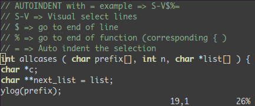
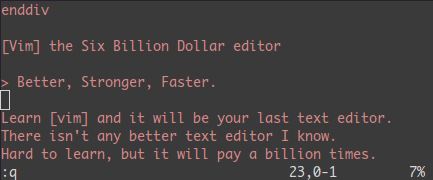

# Vim

.fx: first

Emin Eker `<emineker@bil.omu.edu.tr>`

[http://emineker.net/](http://emineker.net/)

Eylül 2011

---

##  Sistem Yönetimi & Metin Editörleri

*   Özellikle linux temelli işletim sistemleri üzerinde çalışılan sunucularda sistemin ve servislerin yönetimi için çeşitli yönetim arayüzleri geliştirilmiştir

*   Geliştirilen grafik arayüzlerin hem sayısı az hemde yetenekleri kısıtlıdır

*   Bu gibi araçları kullanmak aktif servis veren bir sunucunun sistem kaynaklarından gerektiğinden fazla kullanmasına neden olur

*   Bu ve bunun gibi durumların önüne geçmek için metin editörler tercih edilmektedir

:   Sistem yöneticileri, sistem ve servislere ilişkin yapılandırma dosyalarını düzenleme işlemlerini daima metin editörleri ile yaparlar

---

##  Vim

*   Temeli Bill Joy tarafından tasarlanan yaşı 30 yılı aşmış Vi editörüdür

*   Zaman içerisinde Vi extra özelliklerle güçlendirilmiş ve bugünkü halini almıştır

*   Çok güçlü bir metin editörüdür

Vi ile Vim editörleri arasındaki farklılıkları kaynak dosyalarından öğrenebilirsiniz

        !sh
        $ cat /usr/share/vim/vimr73/doc/vi_diff.txt

---

##  Neden Vim?

*   Linux dağıtımlarında çok fazla metin editörü ve bunların kendilerine ait özellikleri var

*   Bu editörler birbiri ile kıyaslandığında Vim çok gelişmiş bir metin editörüdür

*   Sistem yöneticilerin ve programcıların işlerini oldukça kolaylaştırır

*   Birçok işlemi metin pencerenizi kapatmadan aynı anda yapmanızı sağlar

Vim
:   Unix geleneklerine sahip olup

    *   Unix tabanlı hemen hemen her sistemde bulunur.

    *   Özellikle linux sistem yöneticileri ve programcılar tarafından oldukça yaygın kullanılır

---

##  Vim Temel Özellikleri

*   Çoklu pencere

*   Çoklu seviyede UNDO mekanizması

*   Söz dizimi renklendirme

*   Tampon bellek kullanımı

*   Komut modunda dosya ismi tamamlama

Vim bu gibi temel özellikleri ile kendisini diğer editörlerden oldukça farklı bir noktaya taşımıştır

---

##  Örnek Çalışma Anı

*   Indent (programlama diline özgü girintileri tanır ve kodu düzenler)

*   Split (aynı ekran içerisinde birden fazla dosya üzerinde çalışılabilir)

---

##  Öğrenme

*   Vim alışılması zor bir metin editörü

*   Bir kere alıştığınızda çalışmanız çok hızlanır

*   Alışmak, bir tür içgüdü geliştirmek → "Second Nature"

*   "Second Nature"?  Ellerinizin siz düşünmeden üzerine düşeni yapması

---

##  Asıl Konu

*   Klavyeyi on parmak kullanan insanların bu editöre alışması daha kolaydır

*   Klavyenizde sadece belirli bir görevi olan belirli tuşlar vardır

        + ctrl
        + delete
        + imleçler (yön tuşları)

*   Bu tuşların görevleri Vim üzerinde karakter tuşlarıyla da gerçekleştirilebilmektedir

*   Bunun nedeni elleri klavyenin üzerinden ayırmamak ve sürekliği sağlamaktır

---

.fx: correct

*   Bir bilgisayarcı için on parmak herşey demektir

---

##  Taşınabilir

Vim unix geleneğine sahip bir metin editörü demiştik

*   Bu, sadece unix vari işletim sistemlerinde çalışabildiği anlamına gelmiyor

*   Vim tarşınabilir bir programdır

*   Bu yüzden neredeyse tüm işletim sistemleriyle uyumludur

Linux, FreeBSD, AmigaOS, Atari MINT, BeOS, DOS, MacOS, NextStep, OS/2, OSF, UNIX, VMS + Win32 + Win64 gibi

---

##  Kurulum

*   Linux dağıtımlarında bu editöre ulaşmak oldukça kolaydır

*   Terminale gidelim ve bu komutu girelim

        !sh
        $ sudo apt-get install vim

*   Vim editörünü linux dağıtımımıza yüklemiş olduk

---

##  Nasıl Kullanılır?

*   Vim'e erişmek için terminale ismini yazıp çalıştıralım

        !sh
        $ vim

:   Vim Vi’in daha gelişmiş hali demiştik

            !sh
            $ vi

    komutuyla da vim editörüne ulaşılabilir, vi burada bir alias görevindedir

---

##  3 Mod

Vim 3 temel moddan oluşmaktadır

*   insert

    + dosya üzerinde değişiklikler yapılabilir

    + `i` tuşuna basarak insert yani yazma moduna geçilir

*   escape

    + kısayollar kullanabilir

    + `esc` tuşuna basarak escape moduna geçilir

*   command

    + dosya üzerinde bul/değiştir gibi kısayollar kullanılabilir

    + dosyadan çıkış yapmadan komut satırı işlemlerinin kısmı gerçekleştirilebilir

    + önce `esc` sonra `:` karakteriyle command moda yani komut moduna geçilir

---

##  Dosya açmak

*   Bulunduğumuz dizinde `foo.txt` adında bir dosya açalım

        !sh
        $ vim foo.txt

*   Dosya adını belirtmeden de vim'i açabilir

        !sh
        $ vim

*   Çalıştıktan sonra escape moduna geçip

        !sh
        :w foo.txt

komutu ile dosyamızı foo.txt olarak kaydetmiş oluruz

---

##  Dosyadan Çıkmak

Biraz önce vim ile açtığımız index.html dosyasında

*   düzenleme yaptık ve dosyadan çıkmadan sadece kaydetmek istiyoruz `:w`

*   düzenleme yaptık ve kaydedip çıkmak istiyoruz `:wq`

*   düzenleme yapmadık olduğu gibi çıkmak istiyoruz `:q`

*   düzenleme yaptık ama yaptığımız değişiklikleri kaydetmeden dosyanın ilk halinde çıkmak istiyoruz `:q!`

---

##  İmleçler

*   İmleçler (yön tuşları) ile dosya içerisinde ileri-geri ve-veya sağ-sol yaparak ilerlenebilir

*   Vim içerisinde bu görevi `h-j-k-l` tuşları da yapmaktadır

*   Bu tuşların kullanımı editör içerisinde çok hızlı hareket etmeyi sağlar

         ^
         k	        k tuşu yukarı yönlü hareket eder
    < h     l >	        h tuşu sola, l tuşu sağa hareket eder
         j	        j tuşu aşağı yönlü hereket eder
         v

---

##  Kes - Kopyala - Yapıştır

####  Kes - Kopyala

*   işlemi yapmak istediğimiz satıra gelip

    + kesmek için `dd` tuşuna

    + kopyalamak için `yy` tuşuna basılır

####  Yapıştır

*   yapıştırmak istenilen satıra gelip bu satırın

    + bir alt satırına yapıştırmak için küçük `p` tuşuna

    + bir üst satırına yapıştırmak için büyük `P` tuşuna basılır (shift + p)

---

## Sil

*   Karakter karakter silmek için `delete` ve `x` tuşları kullanılır

*   Visual veya Visual-Block modu ile toplu seçimlerimizde de yine bu tuşlar kullanılabilir

*   Önemli olan Vim mantığı ile ellerimizi kaldırmadan hızlı bir şekilde çalışmaktır

*   `delete` ile silme işlemini yapabiliriz ama `x` vim üzerinde bu göreve atanmıştır

*   `dd` tuşları ile silmek istediğimiz satırı keserek ortadan kaldırmış oluruz

---

##  Geri Al

Dosya üzerinde yapılan işlemler geri alınmak istendiğinde

*   command modda

        !sh
        :u

*   escape modda

        u

ile dosyanın bir işlem önceki haline dönülebilir

---

.fx: wrong

*   imleçler yerine kullanılan `h-j-k-l` tuşları kullanılırken

*   kes - kopyala - yapıştır, sil ve geri gibi işlemler yapılırken

daima escape modunda olunmalıdır

---

## Visual Mod

Birden fazla satır üzerinde işlemler yapılabilir

        !python
        import landslide

        class MyMacro(Macro):
            def process(self, content, source=None):
                return content + '
hop
', ['hop_slide']

        g = generator.Generator(source='slide.md')
        g.register_macro(MyMacro)
        print g.render()

*   Yukarıdaki satırlarda istenilen satırın üzerine `v` tuşuna basılır

*   Arkasından imleçler ile istediğimiz bölge seçilir

*   Kes-Kopyala işlemlerinden birisi yapılır

*   Yapıştırmak istenilen yere yapıştırılır

---

## Visual-Block Mod

*   Visual moddan farkı blok seçim yapılabilmesidir

*   Hemen bir önceki slayttaki kod üzerinde deneme yapalım

*   Satır üzerine gelinir `ctrl + v` tuş kombinasyonuyla `visual-block` moduna geçilir

*   Visual moddaki gibi seçim yapılır

Fark
:   Visual-Block mod

    * istediğimiz bir grup satırın

    * istediğimiz kısımlarını

    seçmemizi sağlar

---

        !html
        

            <header><h2>devamı gelecek</h2></header>
            <section>
                
daha yeni başladık!

            </section>
        

